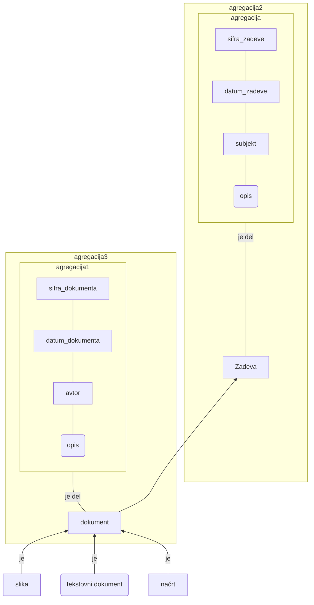

## Abstrakcija
- je kombiniranje različnih tipov

```mermaid
flowchart BT
	subgraph agregacija
		direction TB
		sifra_zadeve --- datum_zadeve --- subjekt --- A(opis)
	end
	subgraph agregacija1
		direction TB
		sifra_dokumenta --- datum_dokumenta --- avtor --- B(opis)
	end
	dokument-->Zadeva
	subgraph agregacija2
		Zadeva---|je del|agregacija
	end
	subgraph agregacija3
		dokument---|je del|agregacija1
	end
	slika-->|je|dokument
	C(tekstovni dokument)-->|je|dokument
	načrt-->|je|dokument
```