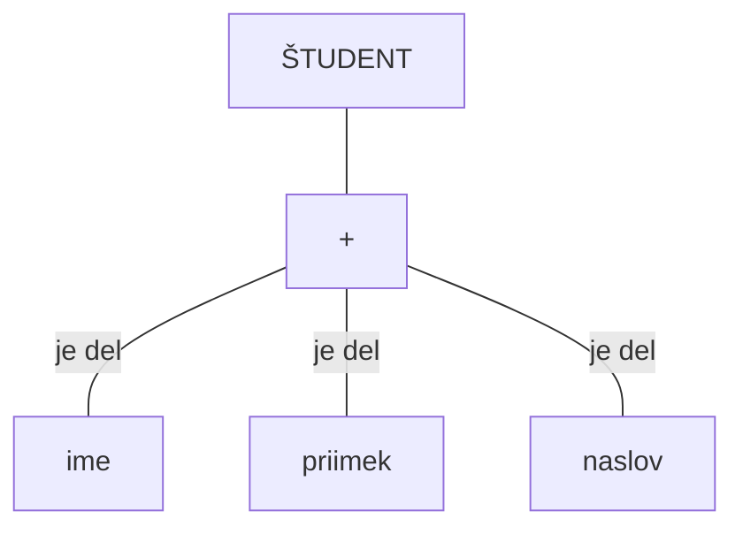

## Agregacija
- lastnosti ali objektov
- lahko imamo več nivojev (vpeljemo "je del" relacijo)

- hierarhija, ki izraža strukturo sestavljenega objekta
- objektom, ki predstavljajo dele nekega sestavljenega objekta, se priredi sestavljeni objekt na višjem nivoju
- objekt je lahko agregat svojih ali drugih objektov
- primer:
	- Vozilo:
		- koroserija
		- podvozje
		- motor: (blok, gred, korter)

