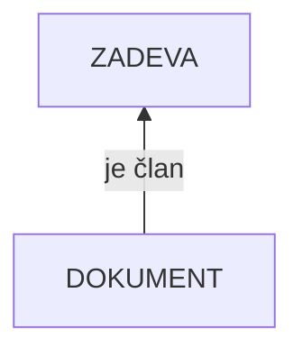

## Asociacija
- samo nekateri primerki so združeni
- dedno pravilo: podmožici primerkov nekega tipa se priredi na višjem nivoju asocirani tip, ki predstavlja skupne lastnosti asociranih primerkov

- zelo podobna [[Generalizacija|generalizaciji]]
- pri asociaciji samo nekateri primerki nekaterega tipa združujejo asocirani tip
- za take primerke velja dedno pravilo (to pomeni, da veljajo vse skupne lastnosti asociarnega tipa, ki ima še svoje lastnosti, ki so skupne celotni množici primerkov)
- pri generalizaciji so vsi primerki člani, pri asociaciji pa samo nekateri