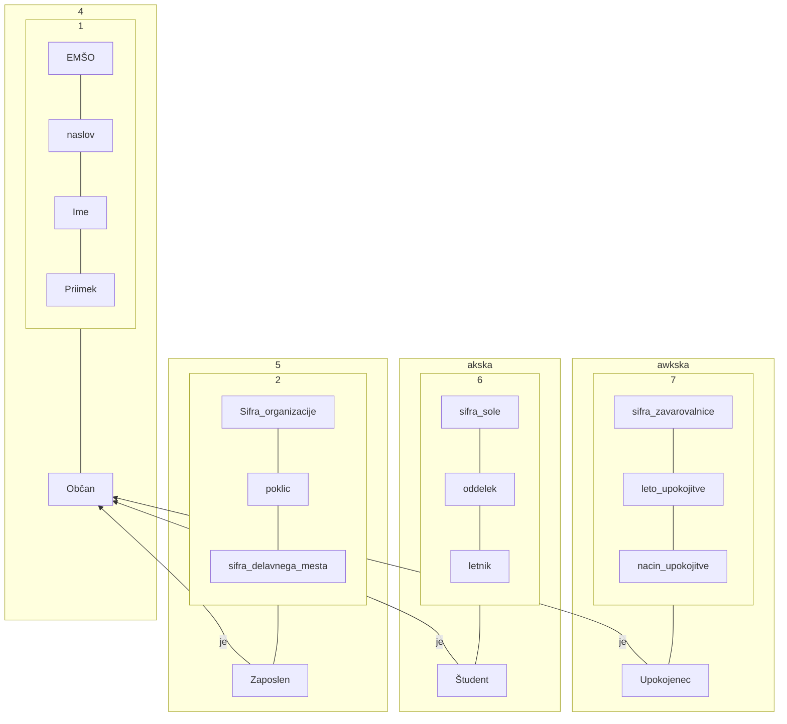

### [[Generalizacija]] in [[Agregacija]]
Uporabimo takrat, ko želimo združiti lastnosti agregacije in generalizacije

```mermaid
flowchart BT
	subgraph 1
		direction TB
		EMŠO---naslov--- Ime--- Priimek
	end
	subgraph 4
	direction LR
		Občan---1
	end
	subgraph 5
	direction LR
		Zaposlen---2
	end
	subgraph 2
		direction TB
		Sifra_organizacije --- poklic --- sifra_delavnega_mesta
	end
	subgraph 6
		direction TB
		sifra_sole --- oddelek --- letnik
	end
	subgraph akska
		Študent---6
	end
	subgraph 7
		direction TB
		sifra_zavarovalnice --- leto_upokojitve --- nacin_upokojitve
	end
	subgraph awkska
		Upokojenec---7
	end
	Zaposlen-->|je|Občan
	Študent-->|je|Občan
	Upokojenec-->|je|Občan
	
```