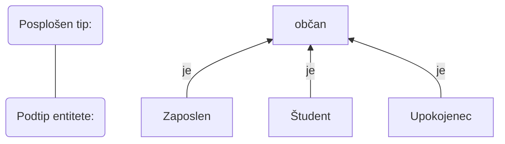
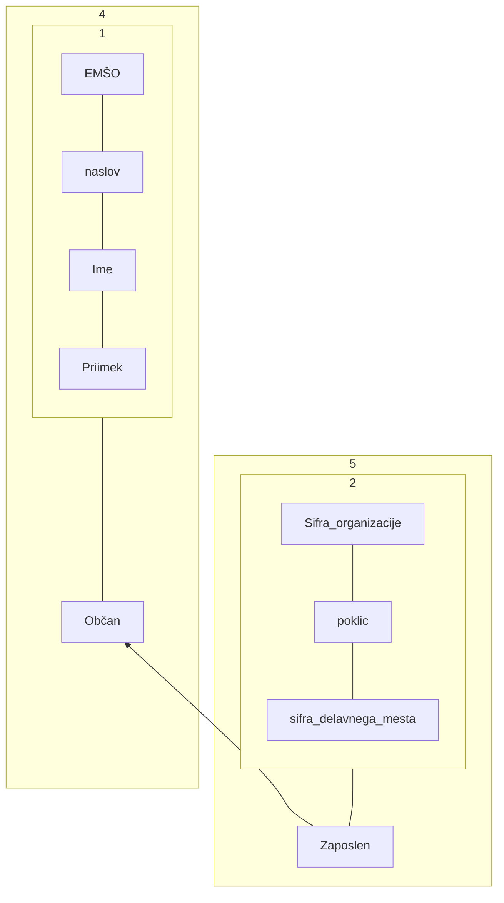

## Generazlizacija
- Posameznim tipom se priredo splošnejši tip na višjem nivoju

- Vpeljemo razmerje "JE" med elementarnimi tipi in posplošenim tipom na všiji ravni. Posplošeni tip lahko predstavlja elementarne in druge posplošene tipe
- Značilno je dedovanje - Lastnosti posplošenega tipa se dedujejo po hierarhiji navzdol

- Po dednem pravilu ima ZAPOSLEN poleg svojih lastnosti še vse lastnosti tipa OBČAN, nima pa nekaterih svojih atributov, ki se ne bi podedovali po hierarhiji navzdol
