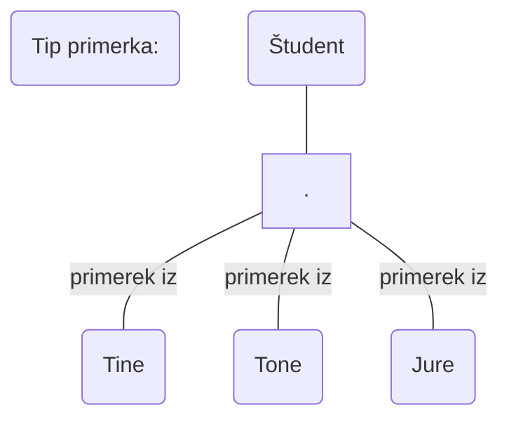

## Klasifikacija
- primerkom objektov, ki imajo skupno lastnost, se priredi tip objektov

Klasifikacija je koncept [[Koncepti abstrakcije pri modeliranju podatkov#Abstrakcija|abstrakcije]], pri katerem primerkom objektov, ki imajo neko skupno lastnost, priredi tip objektov ali razred, ki predstavljajo vse primerke s to lastnostjo
- Pri [[Modeliranje podatkov#Entiteta predmet podatkov objekt|entitetah]] njen tip predstavlja množico primerkov entitet, ki imajo skupne lastnosti

