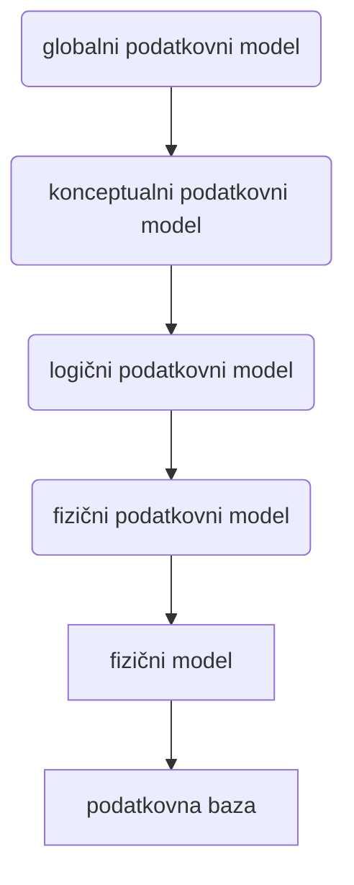

# Modeliranje podatkov
- je oblikovanje modela podatkov v objektih, dogodkih, predmetih, aktivnostih in njihovih povezavah
- <ins>model podatkov</ins> je abstraktna, lahko razumljiva predstavitev podatkov
- <ins>entitetni diagram</ins> - orodje za modeliranje podatkov - prikazuje povezave med različnimi integracijami podatkov

## Modeli podatkov
- abstraktna predstavitev potrebnih podatkov
- strogo določena zgradba:
	- struktura - množica konceptov za opis podatkov in povezav med njimi
	- omejiteve - semantične omejitve za vrednosti (npr. plača delavca)
	- operacije - nad množica z omejitvami (kaj lahko sploh počnemo)

## Podatki
- so osnovna in izhodna sestavina vsakega [[Relacije#Informacijski sistem|informacijskega sistema]]
- so opisi, zapisi nekega pojava ali dejstva
- oblike predstavitve podatkov:
	- številčni
	- tekstovni
	- grafični
- morajo odsevat dejansko stanje
- pomembni so opisi podatkov (metapodatki) - medsebojna odvisnost in povezave
- podatki pri modeliranju se nanašajo na objekte iz realnega sveta - [[Modeliranje podatkov#Entiteta predmet podatkov objekt|entitete]] (so lahko fizične ali abstrakne)

## Gradniki s katerimi oblikujemo modele podatkov
##### Entiteta (predmet podatkov, objekt)
- je objekt opazovanja
- lahko ga enolično identificiramo, izoliramo od okolice in opišemo
- identifikacija (določitev imena, lastnosti in vrednosti lastnosti)

##### Atribut (element podatkov, lastnost entitete)
- [[Modeliranje podatkov#Entiteta predmet podatkov objekt|entiteto]] opišemo z atributi
- je tudi tisti podatek, ki ni več členljiv (z vidika vsebine) npr; datum rojstva, emšo

##### Relacija
Je naravna (vsebinska) povezava med dvema ali več [[Modeliranje podatkov#Entiteta predmet podatkov objekt|entitetami]] (ponazarjajo odnose med predmeti podatkov)

## Ključ
- Je podatkovni element, katerega vrednost loči pojav posameznega predmeta podatkov od drugih pojavov tega elementa
- Dovoljuje enolično identifikacijo določenega predmeta podatkov znotrraj določene množice

Vrste:
###### Primarni ključ
je izbrani atribut ali njihova kombinacija, ki enolično identificira natanko en pojavek entitete
###### Sekundarni (alternativni) ključ
Katerkoli atribut ali njihova kombinacija, s katerim si pomagami pri iskanju podatkov. (Ni nujno enolično)
###### Kandidatni ključ
Je vsak atribut ali kombinacija teh, katere vrednost enolično indentificira natanko en pojavek entitete
###### Sestavljeni ključ
Sestavljen iz več atributov
###### Tuji ključ
Je atribut ali kombinacija teh, ki je primarni ali del sekunardnega ključa v eni entiteti, v drugo pa ga dodamo zato, da opredelimo povezavo med njimi; uporabimo ga v relacijskih shemah

