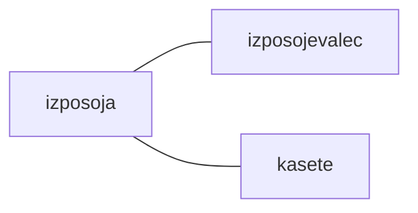
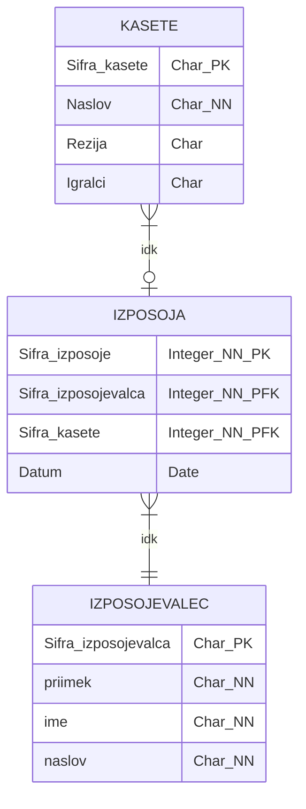

# Primer E-R modela
## 1. Opredelitev entitet in določitev primarnega ključa:
- IZPOSOJEVALEC(<ins>Sifra_izposojevalca</ins>*)
- IZPOSOJA(<ins>Sifra:izposoje</ins>*)
- KASETE(<ins>Sifra_kasete</ins>*)

## 2. Začetna skica entitetnega modela

## 3. Opredelitev in razdelitev atributov po entitetah
- IZPOSOJEVALEC(<ins>Sifra_izposojevalca</ins>\*, priimek, ime, naslov, hisna_stevilka, posta, postna:st.)
- IZPOSOJA(<ins>Sifra:izposoje</ins>\*, <ins>sifra_izposojevalca</ins>, <ins>sifra_kasete</ins>, datum)
- KASETE(<ins>Sifra_kasete</ins>\*, naslov, režija, igralci)

## 4. Zapis relacijske sheme
- Izposojevalec(<ins>Sifra_izposojevalca</ins>: A(5), priimek: A(20), ime: A(20), naslov: A(20), hisna_stevilka: A(5), posta: A(20), postna_stevilka: N)
- Kasete(<ins>Sifra_kasete</ins>: A(5), naslov: A(20), režija: A(15), igralci: A(15))
- Izposoja(<ins>Sifra_izposoje</ins>: A(5), <ins>Sifra_izposojevalca</ins>: A(5)->Izposojevalec, <ins>Sifra_kasete</ins>: A(5)->kasete, datum: D)

## 5. Zapis ER diagrama
