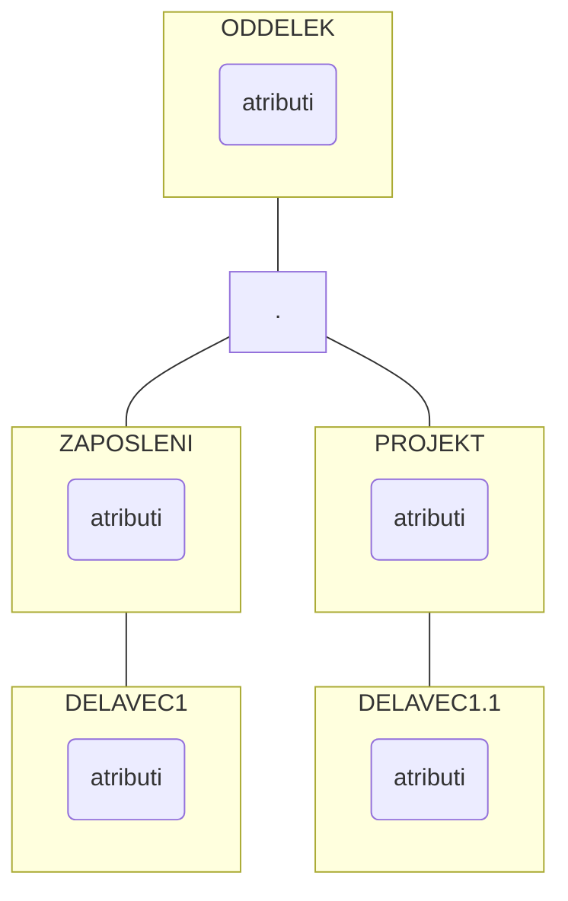

## Hierarhični podatkovni model
- pri modeliranju hierarhičnih struktur
- ni teoretičnih predpostavk, ampak so nastali zaradi potreb v praksi
- dva osnovna gradnika modeliranja:
	- zapis je zbirka polj, ki vsebujejo podatke o posameznih primerkih entitet ali povezav med njimi
	- povezava oče-sin je tipa 1 : n med dvema različnima tipoma zapisov (1:n = 1 oče več sinov)
- Lastnosti:
	- najvišji v hierarhiji je en tip zapisa (koren-root); koren nima nadrejenega zapisa tipa oče
	- vsak tip zapisa (razen korena) sodeluje v natanko eni povezavi (sinovi imajo enega očeta)
	- vsak tip zapisa sodeluje kot oče vp oljubnem številu povezav (en oče ima več sinov)
	- tipi zapisov, ki ne sodelujejo v nobeni povezavi kot očetje so ?listi?
- Ta model se uporablja za strogo hierarhično urejene podatke. Histrost dostopa do podatkov preko povezave oče-sin je zelo velika
- Drugi načini iskanja so v tej strukturi prepočasni. Primer: Iščemo delavca Janeza

