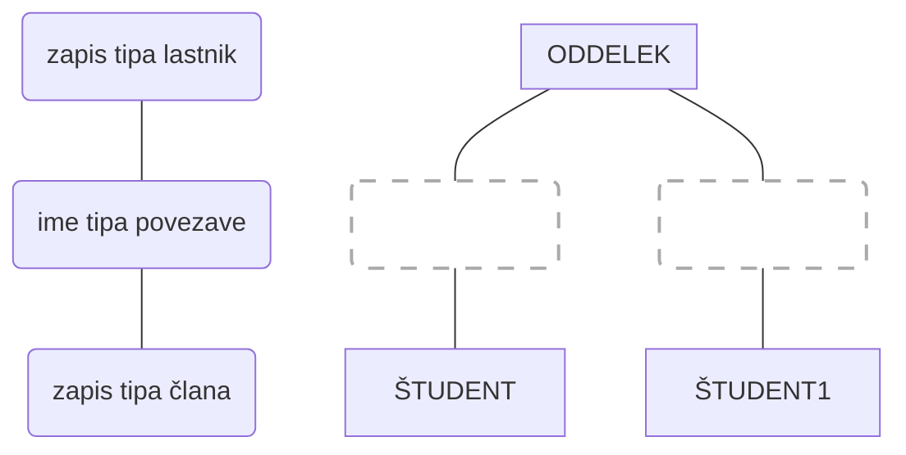
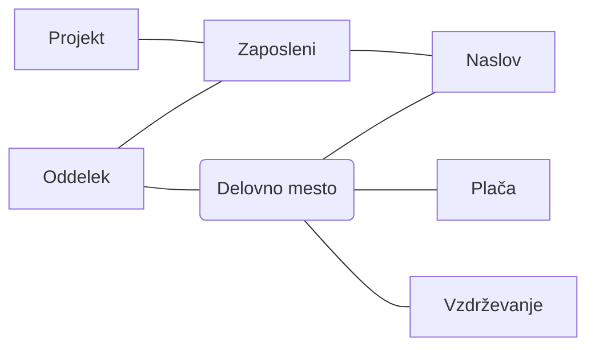

## Mrežni podatkovni model
- hitra uveljavitev v praksi
- nastanek: produkt CODASYL (Conference On Data System Languages)
- podatki so shranjeni v zapise (vsebujejo skupno polj z medsebojno povezanimi vrednostmi podatkov)
- več zapisov skupaj - tip zapisov (vsak določa strukturo skupine zapisov v katerih so informacije istega tipa)
- vsak tip zapisa ima svoje ime
- tip povezave: (v shemi poljubno število tipa povezav):
	- ima tipa povezave
	- zapis tipa lastnik
	- zapis tipa class (le en član v enem primerku povezave določenega tipa)
- slabost je dostop do podatkov (ta je vnaprej določen in vgrajen v mrežo modela - pri kompleksnih sistemih je to problem)

-----

- Je [[Generalizacija]] hierarhičnega
- več svobode
- zapisi so poljubno povezani med seboj, tako da tvorijo mrežo:
	- na najvišljem nivoju je lahko več vozlev, tako dobimo več vstopnih poti do zapisa na nižjih nivojih
	- Zapisi znotraj strukture imajo lahko poljubno št. nadrejenih in prav tako poljbuno št. podrejenih zapisov
- Na ta način imamo precej več svobode pri dostopu do zapisov, ki so povezani v mrežni strukturi
- primer: nevrovske mreže